# StyleOS - Technical Product Documentation

> **AI-Powered Wardrobe Intelligence Platform**

**Live:** [https://styleos.dev](https://styleos.dev)

**Test Account:** `test@styleos.dev` / `teststyleos`

---

## Table of Contents

1. [Executive Summary](#executive-summary)
2. [Product Vision & Features](#product-vision--features)
3. [System Architecture](#system-architecture)
4. [Technology Stack](#technology-stack)
5. [Database Schema](#database-schema)
6. [API Documentation](#api-documentation)
7. [AI Capabilities](#ai-capabilities)
8. [Security Architecture](#security-architecture)
9. [Scalability & Performance](#scalability--performance)
10. [Cost Analysis](#cost-analysis)
11. [Roadmap](#roadmap)

---

## Executive Summary

StyleOS is an enterprise-grade AI-powered wardrobe management platform that transforms how users organize, visualize, and style their clothing. Built on a modern React/FastAPI/Supabase stack with sophisticated AI integrations, StyleOS enables users to catalog clothing via photo or URL import, receive AI-powered styling recommendations, and virtually try on outfits before wearing them.

### Key Value Propositions

| Value | Description |
|-------|-------------|
| **Smart Cataloging** | AI extracts clothing attributes (category, color, pattern, material) from photos automatically |
| **URL Import** | Scrape product details from any e-commerce site and add to wardrobe instantly |
| **Background Cleanup** | Professional e-commerce quality images generated via AI |
| **Outfit Intelligence** | ML-powered outfit suggestions based on occasion, weather, and style preferences |
| **Virtual Try-On** | See outfits on your body before wearing (Nanobanana API integration) |
| **Enterprise Security** | Row-level security, JWT auth, SSRF protection, rate limiting |

### Quick Stats

| Metric | Value |
|--------|-------|
| Database Tables | 20+ |
| Performance Indexes | 40+ |
| API Endpoints | 8 |
| AI Models Integrated | 3 (Gemini Vision, Gemini 2.5 Flash Image, FireCrawl) |
| Storage Buckets | 4 |
| Supported Retailers | 10+ (extensible) |

---

## Product Vision & Features

### Core Features

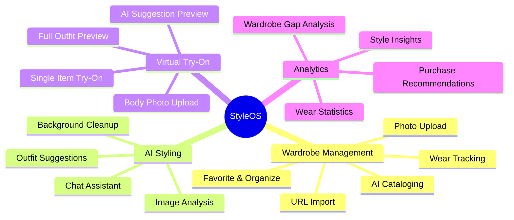

### Feature Matrix

| Feature | Status | AI-Powered | Description |
|---------|--------|------------|-------------|
| Photo Upload | Live | Yes | Upload clothing photos, AI extracts attributes |
| URL Import | Live | Yes | Paste e-commerce URL, scrape product + images |
| Background Cleanup | Live | Yes | Generate white-background product images |
| Wardrobe Grid | Live | No | View, filter, search, sort clothing items |
| Outfit Creation | Live | No | Combine items into outfits |
| Outfit Suggestions | Schema Ready | Yes | AI suggests outfits by occasion/weather |
| Virtual Try-On | Schema Ready | Yes | See items on your body via Nanobanana |
| AI Chat Stylist | In Progress | Yes | Conversational styling assistant |
| Weather Integration | Schema Ready | Yes | Weather-aware outfit recommendations |
| Gap Analysis | Schema Ready | Yes | Identify missing wardrobe pieces |

---

## System Architecture

### High-Level Architecture

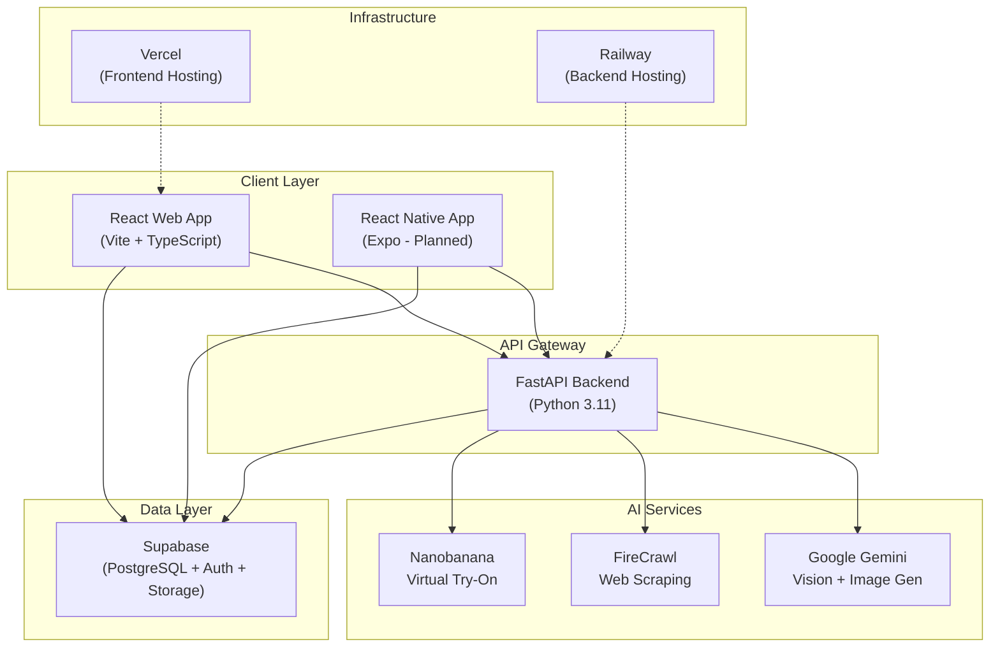

### Monorepo Structure

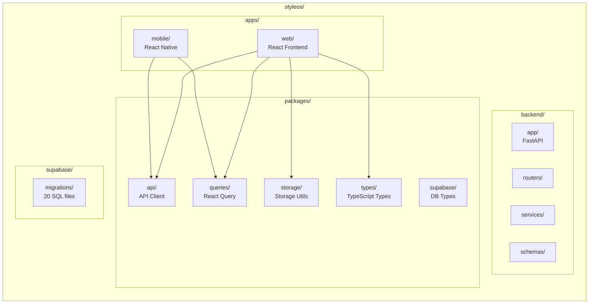

### Frontend Component Hierarchy

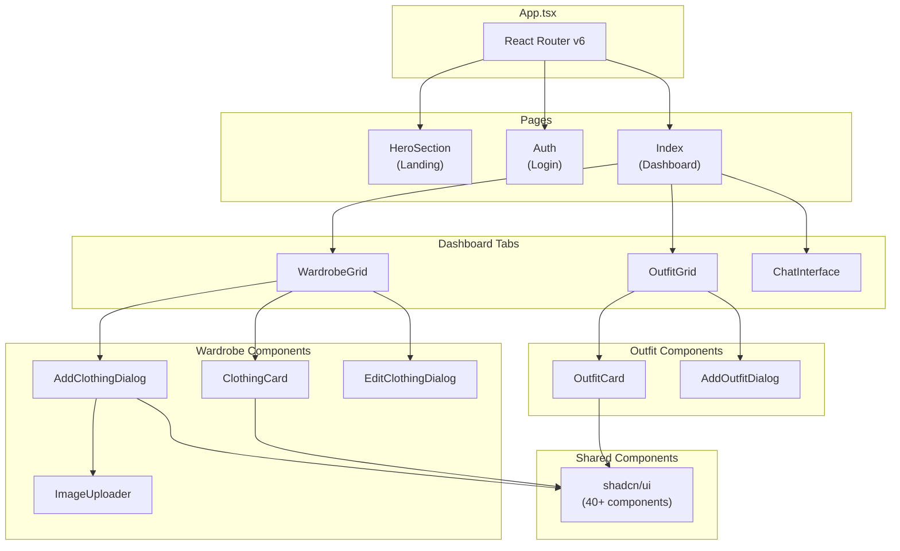

### Backend Service Architecture

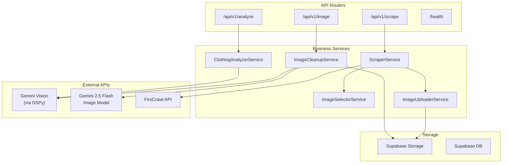

### Authentication Flow

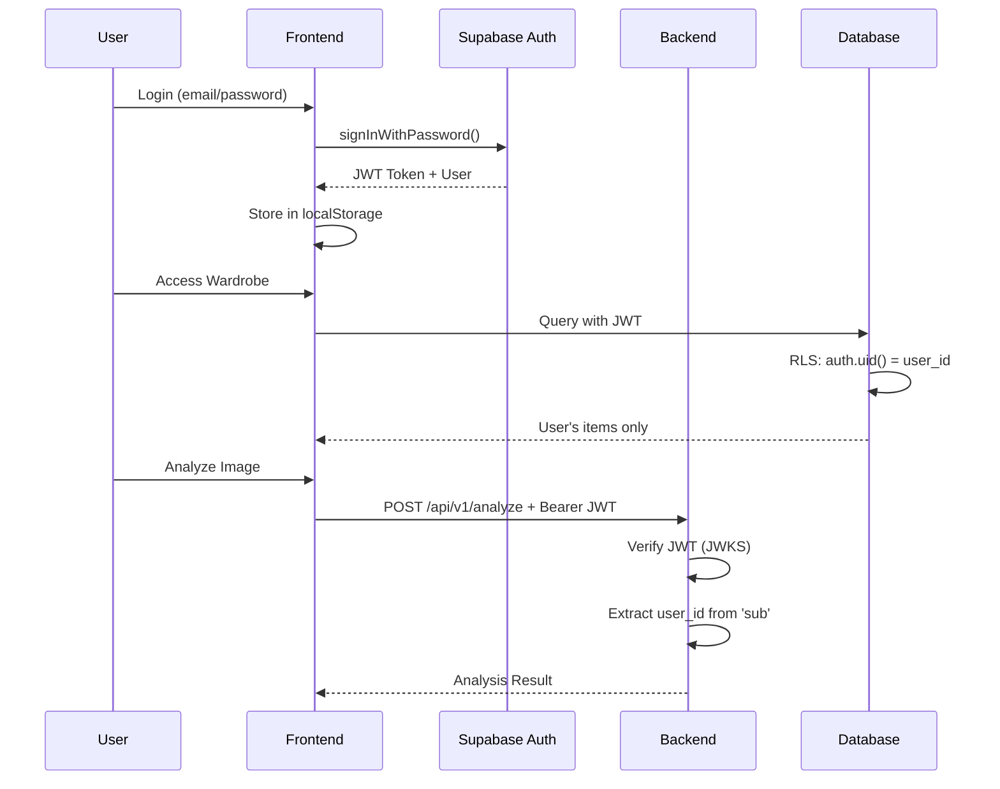

### Data Flow Diagram

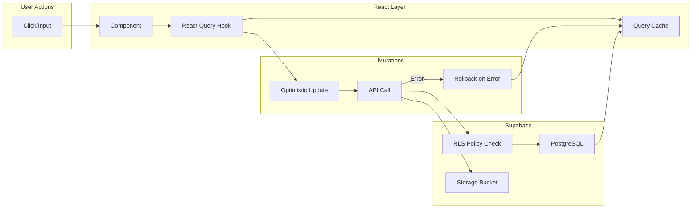

---

## Technology Stack

### Frontend Stack

| Technology | Version | Purpose | License |
|------------|---------|---------|---------|
| React | 18.x | UI Framework | MIT |
| TypeScript | 5.x | Type Safety | Apache-2.0 |
| Vite | 6.x | Build Tool (with SWC) | MIT |
| TanStack Query | 5.x | Server State Management | MIT |
| React Router | 6.x | Client-side Routing | MIT |
| Tailwind CSS | 3.x | Utility-first Styling | MIT |
| shadcn/ui | Latest | Component Library (40+ components) | MIT |
| React Hook Form | 7.x | Form Management | MIT |
| Zod | 3.x | Schema Validation | MIT |
| Vercel AI SDK | Latest | AI Chat Integration | MIT |

### Backend Stack

| Technology | Version | Purpose | License |
|------------|---------|---------|---------|
| Python | 3.11 | Runtime | PSF |
| FastAPI | 0.122.0 | Web Framework | MIT |
| Uvicorn | 0.34.0 | ASGI Server | BSD |
| Pydantic | 2.9.2 | Data Validation | MIT |
| DSPy | 3.0.4 | Declarative AI Framework | MIT |
| google-genai | 1.0.0+ | Google Generative AI | Apache-2.0 |
| firecrawl-py | 1.0.0+ | Web Scraping | MIT |
| httpx | 0.27.2 | Async HTTP Client | BSD |
| slowapi | 0.1.9 | Rate Limiting | MIT |
| PyJWT | 2.8.0 | JWT Verification | MIT |
| uv | Latest | Package Manager (Rust-based) | Apache-2.0 |

### Infrastructure

| Service | Purpose | Tier |
|---------|---------|------|
| Vercel | Frontend Hosting | Pro |
| Railway | Backend Hosting | Hobby/Pro |
| Supabase | Database + Auth + Storage | Free/Pro |
| Google Cloud | AI APIs (Gemini) | Pay-per-use |
| FireCrawl | Web Scraping | Pay-per-use |

### Third-Party AI Services

| Service | Model | Purpose | Cost Model |
|---------|-------|---------|------------|
| Google Gemini | gemini-2.5-flash | Image Analysis, Background Detection | $0.075/1M input tokens |
| Google Gemini | gemini-2.5-flash-preview-image | Background Cleanup (Image Gen) | $0.075/1M tokens |
| FireCrawl | N/A | E-commerce Scraping | $0.001/page (Standard) |
| Nanobanana | N/A | Virtual Try-On | Per-request pricing |

---

## Database Schema

### Entity Relationship Diagram

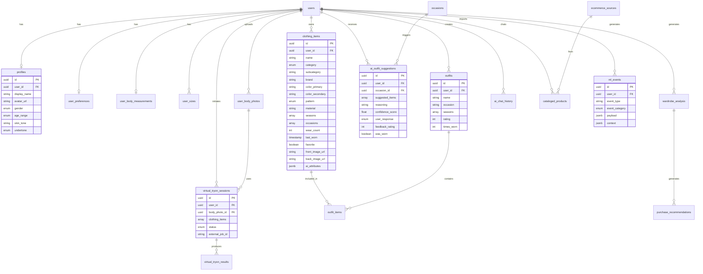

### Core Tables

| Table | Purpose | Key Columns | RLS |
|-------|---------|-------------|-----|
| `clothing_items` | Wardrobe inventory | id, user_id, name, category, colors, seasons, occasions, wear_count, images | User-scoped |
| `outfits` | Outfit collections | id, user_id, name, occasion, seasons, rating, times_worn | User-scoped |
| `outfit_items` | Junction (outfit ↔ items) | outfit_id, item_id (composite PK) | Via parent |
| `profiles` | User metadata | id, user_id, display_name, physical attributes | Public read, owner write |
| `user_preferences` | Style preferences | user_id (PK), favorite_colors, avoided_colors, lifestyle, budget | User-scoped |

### Sizing & Measurements

| Table | Purpose | Key Columns | RLS |
|-------|---------|-------------|-----|
| `user_body_measurements` | Body metrics (metric + imperial) | height, weight, chest, waist, hips, body_shape | User-scoped, UNIQUE |
| `user_sizes` | Category-specific sizes | category, subcategory, size_us/uk/eu, fit_preference | User-scoped |

### AI & Recommendations

| Table | Purpose | Key Columns | RLS |
|-------|---------|-------------|-----|
| `ai_outfit_suggestions` | AI-generated outfit recommendations | suggested_items[], confidence_score, user_response, was_worn | User-scoped |
| `wardrobe_analysis` | Gap analysis results | analysis_type, missing_categories[], versatility_score | User-scoped |
| `purchase_recommendations` | Shopping suggestions | category, suggested_colors[], price_range, priority | User-scoped |
| `ai_chat_history` | Stylist conversation history | session_id, role, content, referenced_items[] | User-scoped |

### Virtual Try-On

| Table | Purpose | Key Columns | RLS |
|-------|---------|-------------|-----|
| `user_body_photos` | Body photos for try-on | image_url, photo_type, body_landmarks (JSONB), is_primary | User-scoped |
| `virtual_tryon_sessions` | Try-on requests | body_photo_id, clothing_items[], status, external_job_id | User-scoped |
| `virtual_tryon_results` | Generated images | result_image_url, quality_score, expires_at (30 days) | User-scoped |

### E-Commerce Integration

| Table | Purpose | Key Columns | RLS |
|-------|---------|-------------|-----|
| `ecommerce_sources` | Supported retailers (10 seeded) | name, base_url, url_patterns[], scraper_config | Read-only for users |
| `cataloged_products` | URL import cache (48h TTL) | source_url, name, brand, price, image_urls[], status | User-scoped |

### System Tables

| Table | Purpose | TTL | RLS |
|-------|---------|-----|-----|
| `occasions` | Event types (20 system + custom) | None | System: public, Custom: user-scoped |
| `weather_cache` | Weather API cache | 30 min | Service-role write, user read |
| `product_cache` | Search result cache | 7 days | Service-role write, user read |
| `ml_events` | ML training data (append-only) | None | User-scoped |

### Storage Buckets

| Bucket | Public | Max Size | Types | Purpose |
|--------|--------|----------|-------|---------|
| `clothing-images` | Yes | Unlimited | jpg, png, webp | Wardrobe item photos |
| `user-photos` | No | 5MB | jpg, png, webp | Body photos for try-on |
| `tryon-results` | No | 10MB | jpg, png, webp | Generated try-on images |
| `product-cache` | Yes | 2MB | jpg, png, webp, gif | Cached product images |

---

## API Documentation

### Endpoints Overview

| Endpoint | Method | Auth | Rate Limit | Purpose |
|----------|--------|------|------------|---------|
| `POST /api/v1/analyze/image` | POST | Required | 60/hour | AI clothing image analysis |
| `POST /api/v1/image/detect-background` | POST | Required | 60/hour | Detect if cleanup needed |
| `POST /api/v1/image/cleanup` | POST | Required | 20/hour | Generate white-background image |
| `POST /api/v1/scrape/url` | POST | Required | 20/hour | Scrape e-commerce product |
| `GET /health` | GET | None | None | Service health check |
| `GET /health/db` | GET | None | None | Database connectivity check |

### Image Analysis API

**Endpoint:** `POST /api/v1/analyze/image`

**Request:**
```json
{
  "image_url": "https://example.com/shirt.jpg"
}
```

**Response:**
```json
{
  "category": "tops",
  "subcategory": "T-Shirt",
  "suggested_name": "Navy Blue Cotton Crew Neck T-Shirt",
  "color_primary": "#1e40af",
  "color_secondary": "",
  "pattern": "solid",
  "material": "cotton",
  "brand": "Nike",
  "style_tags": ["casual", "minimalist", "everyday"],
  "seasons": ["Spring", "Summer", "Fall"],
  "occasions": ["Casual", "Gym"],
  "confidence": 0.92
}
```

### Background Cleanup API

**Endpoint:** `POST /api/v1/image/cleanup`

**Request:**
```json
{
  "image_url": "https://example.com/shirt-on-model.jpg",
  "force": false
}
```

**Response:**
```json
{
  "cleaned_image_url": "https://supabase.co/storage/v1/object/sign/clothing-images/...",
  "storage_path": "user-123/a1b2c3d4.png",
  "processing_time_ms": 2847
}
```

### URL Scraping API

**Endpoint:** `POST /api/v1/scrape/url`

**Request:**
```json
{
  "url": "https://www.uniqlo.com/us/en/products/E123456",
  "analyze_image": true
}
```

**Response:**
```json
{
  "name": "Relaxed Fit Cotton T-Shirt",
  "brand": "Uniqlo",
  "price": 19.99,
  "currency": "USD",
  "category": "tops",
  "subcategory": "T-Shirt",
  "material": "100% Cotton",
  "image_urls": ["https://...", "https://..."],
  "primary_image_url": "https://supabase.co/storage/...",
  "description": "A comfortable cotton t-shirt...",
  "retailer": "Uniqlo",
  "source_url": "https://www.uniqlo.com/...",
  "color_primary": "#1f2937",
  "pattern": "solid",
  "style_tags": ["casual", "minimalist"],
  "seasons": ["Spring", "Summer", "Fall"],
  "occasions": ["Casual"],
  "confidence": 0.89
}
```

### Code Example: React Query Hook

```typescript
// apps/web/src/hooks/queries/useClothingItemsQuery.ts
import { useQuery } from '@tanstack/react-query';
import { queryKeys } from '@/lib/react-query/queryKeys';
import { supabase } from '@/integrations/supabase/client';
import { getSignedUrls } from '@/lib/storage';

export function useClothingItemsQuery() {
  const { user } = useAuth();

  return useQuery({
    queryKey: queryKeys.clothingItems.list(user?.id ?? ''),
    queryFn: async () => {
      const { data, error } = await supabase
        .from('clothing_items')
        .select('*')
        .order('created_at', { ascending: false });

      if (error) throw error;

      // Batch generate signed URLs for all images
      const imagePaths = data
        .flatMap(item => [item.front_image_url, item.back_image_url])
        .filter(Boolean);

      const signedUrls = await getSignedUrls(imagePaths);

      return data.map(item => ({
        ...item,
        front_image_url: signedUrls[item.front_image_url] ?? item.front_image_url,
        back_image_url: signedUrls[item.back_image_url] ?? item.back_image_url,
      }));
    },
    enabled: !!user,
    staleTime: 50 * 60 * 1000, // 50 minutes (matches signed URL expiry)
  });
}
```

### Code Example: FastAPI Router

```python
# backend/app/routers/analyze.py
from fastapi import APIRouter, Depends, HTTPException
from app.schemas.analyze import ImageAnalysisRequest, ClothingAnalysisResponse
from app.services.clothing_analyzer import ClothingAnalyzerService
from app.dependencies import get_required_user, User
from slowapi import Limiter
from slowapi.util import get_remote_address

router = APIRouter(prefix="/api/v1/analyze", tags=["analyze"])
limiter = Limiter(key_func=get_remote_address)

@router.post("/image", response_model=ClothingAnalysisResponse)
@limiter.limit("60/hour")
async def analyze_clothing_image(
    request: ImageAnalysisRequest,
    user: User = Depends(get_required_user)
):
    """
    Analyze a clothing image using AI to extract attributes.

    Rate limit: 60 requests per hour per user.
    """
    analyzer = ClothingAnalyzerService()

    try:
        result = await analyzer.analyze_image(request.image_url)
        return ClothingAnalysisResponse(**result.model_dump())
    except ValueError as e:
        raise HTTPException(status_code=400, detail=str(e))
```

---

## AI Capabilities

### AI Pipeline Architecture

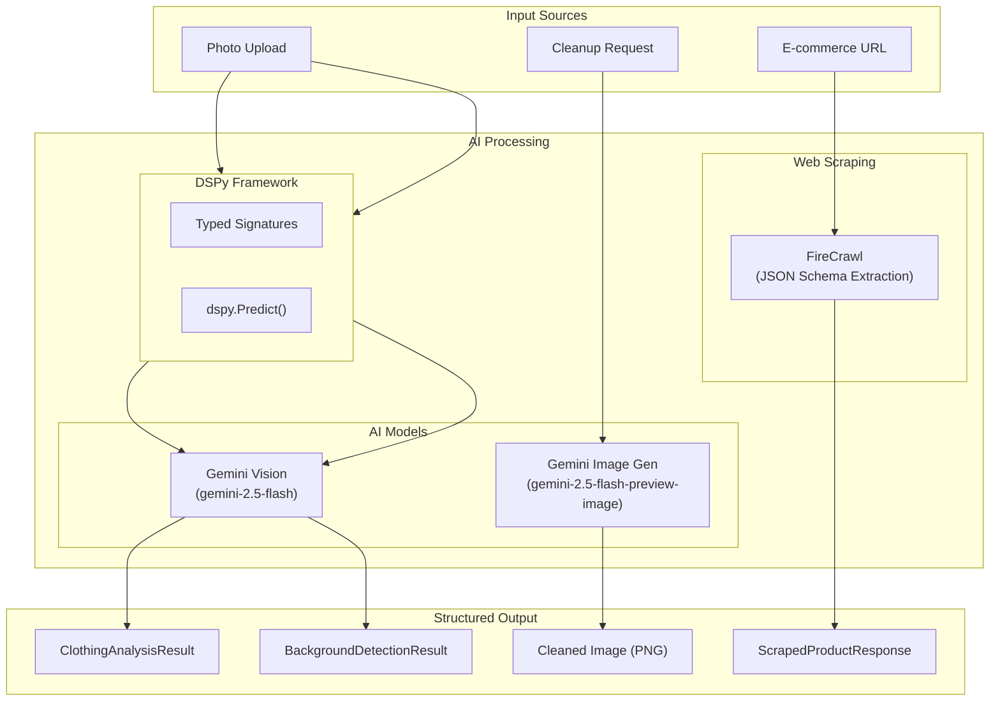

### DSPy Signatures

```python
# backend/app/services/signatures/__init__.py

class ClothingImageAnalysis(dspy.Signature):
    """Analyze a clothing item image and extract detailed attributes."""

    image: dspy.Image = dspy.InputField(desc="The clothing item image to analyze")

    category: str = dspy.OutputField(desc="tops, bottoms, dresses, outerwear, shoes, accessories")
    subcategory: str = dspy.OutputField(desc="Specific type (T-Shirt, Jeans, Blazer, etc.)")
    suggested_name: str = dspy.OutputField(desc="Descriptive name for the item")
    color_primary: str = dspy.OutputField(desc="Primary color as hex code (#RRGGBB)")
    color_secondary: str = dspy.OutputField(desc="Secondary color or empty string")
    pattern: str = dspy.OutputField(desc="solid, striped, floral, checkered, geometric")
    material: str = dspy.OutputField(desc="Detected material (cotton, polyester, etc.)")
    brand: str = dspy.OutputField(desc="Brand name if visible, else empty string")
    style_tags: list[str] = dspy.OutputField(desc="Style descriptors")
    seasons: list[str] = dspy.OutputField(desc="Suitable seasons")
    occasions: list[str] = dspy.OutputField(desc="Suitable occasions")
    confidence: float = dspy.OutputField(desc="Confidence score 0.0-1.0")


class BackgroundQualityAnalysis(dspy.Signature):
    """Analyze the BACKGROUND of a clothing image (not the product itself)."""

    image: dspy.Image = dspy.InputField(desc="The image to analyze")

    needs_cleanup: bool = dspy.OutputField(desc="Whether background needs cleanup")
    background_type: str = dspy.OutputField(desc="white, solid, gradient, complex, outdoor")
    reason: str = dspy.OutputField(desc="Explanation of the assessment")
    confidence: float = dspy.OutputField(desc="Confidence score 0.0-1.0")
```

### AI Feature Matrix

| Feature | Model | Input | Output | Avg. Latency |
|---------|-------|-------|--------|--------------|
| Image Analysis | Gemini Vision (via DSPy) | Image URL | Structured attributes | ~2-3s |
| Background Detection | Gemini Vision (via DSPy) | Image URL | needs_cleanup, type, reason | ~1-2s |
| Background Cleanup | Gemini 2.5 Flash Image | Image bytes | PNG with white background | ~3-5s |
| Product Scraping | FireCrawl + LLM | URL | Product data + images | ~5-10s |
| Image Selection | Gemini (via DSPy) | Image URL list | Best product image index | ~1s |

### ML Event Tracking

```mermaid
flowchart LR
    subgraph Events["User Events"]
        ItemAdded["item_added"]
        ItemWorn["item_worn"]
        SuggestionAccepted["suggestion_accepted"]
        SuggestionRejected["suggestion_rejected"]
        TryOnSaved["tryon_saved"]
    end

    subgraph MLEvents["ml_events Table"]
        EventType["event_type"]
        Category["event_category"]
        Payload["payload (JSONB)"]
        Context["context (JSONB)"]
    end

    subgraph Training["Future ML Training"]
        Recommendation["Better Recommendations"]
        Personalization["Style Personalization"]
        TrendAnalysis["Trend Analysis"]
    end

    Events --> MLEvents
    MLEvents --> Training
```

**Event Categories:**
- `wardrobe`: item_added, item_updated, item_deleted, item_worn, item_favorited
- `outfit`: outfit_created, outfit_worn, outfit_rated
- `suggestion`: suggestion_shown, suggestion_accepted, suggestion_rejected, suggestion_modified
- `tryon`: tryon_initiated, tryon_completed, tryon_saved
- `chat`: chat_started, chat_action_taken
- `analysis`: analysis_requested, recommendation_viewed

---

## Security Architecture

### Security Layers

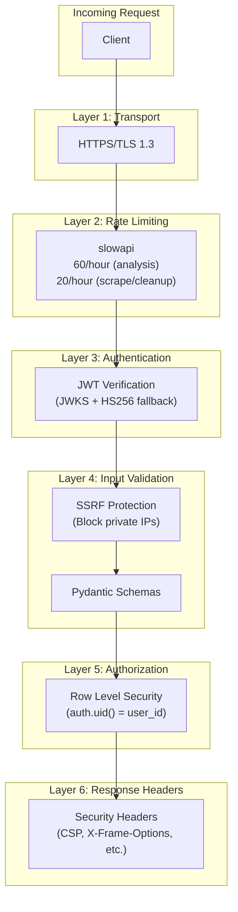

### JWT Authentication Flow

```python
# backend/app/dependencies.py (simplified)

async def verify_jwt(token: str) -> dict:
    """
    Verify JWT using JWKS (public keys) from Supabase.
    Falls back to HS256 symmetric key for local development.
    """
    # Try JWKS verification first (production)
    try:
        jwks = await fetch_jwks(f"{SUPABASE_URL}/auth/v1/.well-known/jwks.json")
        public_key = get_public_key(jwks, token)

        return jwt.decode(
            token,
            public_key,
            algorithms=["ES256", "RS256"],
            audience="authenticated",
            issuer=f"{SUPABASE_URL}/auth/v1"
        )
    except JWKSError:
        # Fallback to HS256 (local development)
        return jwt.decode(
            token,
            SUPABASE_JWT_SECRET,
            algorithms=["HS256"],
            audience="authenticated"
        )
```

### Row Level Security Example

```sql
-- Example RLS policy for clothing_items
CREATE POLICY "Users can view own items"
ON clothing_items FOR SELECT
USING (auth.uid() = user_id);

CREATE POLICY "Users can insert own items"
ON clothing_items FOR INSERT
WITH CHECK (auth.uid() = user_id);

CREATE POLICY "Users can update own items"
ON clothing_items FOR UPDATE
USING (auth.uid() = user_id)
WITH CHECK (auth.uid() = user_id);  -- Prevents user_id reassignment

CREATE POLICY "Users can delete own items"
ON clothing_items FOR DELETE
USING (auth.uid() = user_id);
```

### SSRF Protection

```python
# backend/app/services/image_cleanup.py

BLOCKED_IP_RANGES = [
    ipaddress.ip_network("10.0.0.0/8"),      # Private Class A
    ipaddress.ip_network("172.16.0.0/12"),   # Private Class B
    ipaddress.ip_network("192.168.0.0/16"),  # Private Class C
    ipaddress.ip_network("127.0.0.0/8"),     # Loopback
    ipaddress.ip_network("169.254.0.0/16"),  # Link-local (cloud metadata)
    ipaddress.ip_network("0.0.0.0/8"),       # Reserved
]

def is_url_safe(url: str) -> bool:
    """Check if URL is safe to fetch (not pointing to internal resources)."""
    parsed = urlparse(url)
    if parsed.scheme not in ("http", "https"):
        return False

    try:
        ip = ipaddress.ip_address(socket.gethostbyname(parsed.hostname))
        return not any(ip in network for network in BLOCKED_IP_RANGES)
    except:
        return False
```

### Security Headers

```python
# backend/app/middleware/security.py

SECURITY_HEADERS = {
    "X-Content-Type-Options": "nosniff",
    "X-Frame-Options": "DENY",
    "X-XSS-Protection": "1; mode=block",
    "Referrer-Policy": "strict-origin-when-cross-origin",
    "Permissions-Policy": "accelerometer=(), camera=(), geolocation=(), ...",
    "Content-Security-Policy": "default-src 'none'; frame-ancestors 'none'",
}

# Cache control for API routes
API_CACHE_HEADERS = {
    "Cache-Control": "no-store, no-cache, must-revalidate",
    "Pragma": "no-cache",
}
```

---

## Scalability & Performance

### Caching Strategy

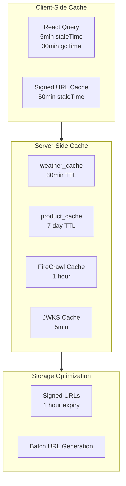

### Database Indexing Strategy

| Index Type | Count | Purpose |
|------------|-------|---------|
| Composite (user_id + X) | 15+ | Fast user-scoped queries |
| GIN (arrays) | 10+ | Fast array contains queries |
| Trigram (text) | 2 | Fuzzy text search |
| Partial | 5+ | Filtered indexes (favorites, primary photos) |

**Example Indexes:**
```sql
-- Composite index for user's items by category
CREATE INDEX idx_clothing_items_user_category
ON clothing_items(user_id, category);

-- GIN index for season array search
CREATE INDEX idx_clothing_items_seasons_gin
ON clothing_items USING GIN(seasons);

-- Partial index for favorites only
CREATE INDEX idx_clothing_items_favorites
ON clothing_items(user_id) WHERE favorite = true;

-- Trigram index for fuzzy name search
CREATE INDEX idx_clothing_items_name_trgm
ON clothing_items USING GIN(name gin_trgm_ops);
```

### Query Optimization

**N+1 Query Fix (Outfits):**
```typescript
// Before: N+1 queries for outfit items
const outfits = await supabase.from('outfits').select('*');
for (const outfit of outfits) {
  const items = await supabase.from('outfit_items')
    .select('*, clothing_items(*)')
    .eq('outfit_id', outfit.id);  // N queries!
}

// After: Single query with join
const { data: outfitItems } = await supabase
  .from('outfit_items')
  .select('*, clothing_items(*), outfits!inner(*)');

// Batch signed URL generation
const uniquePaths = [...new Set(items.map(i => i.front_image_url))];
const signedUrls = await getSignedUrls(uniquePaths);  // 1 batch call
```

### Performance Metrics

| Operation | Target | Actual |
|-----------|--------|--------|
| Wardrobe load (100 items) | < 500ms | ~300ms |
| Image analysis | < 5s | ~2-3s |
| Background cleanup | < 10s | ~3-5s |
| URL scraping | < 15s | ~5-10s |
| Database query (indexed) | < 50ms | ~20ms |

---

## Cost Analysis

### Infrastructure Costs (Monthly Estimates)

| Service | Tier | Cost/Month | Notes |
|---------|------|------------|-------|
| **Vercel** | Pro | $20 | Includes 100GB bandwidth, unlimited builds |
| **Railway** | Hobby | $5-20 | Usage-based, ~$5 for low traffic |
| **Supabase** | Free/Pro | $0-25 | Free tier: 500MB DB, 1GB storage |
| **Total Infrastructure** | - | **$25-65** | |

### AI API Costs (Per 1,000 Operations)

| Operation | API | Cost/1K | Notes |
|-----------|-----|---------|-------|
| Image Analysis | Gemini Vision | ~$0.075 | ~1K tokens/request |
| Background Detection | Gemini Vision | ~$0.05 | ~500 tokens/request |
| Background Cleanup | Gemini Image | ~$0.50 | Image generation is costlier |
| URL Scraping | FireCrawl | $1.00 | $0.001/page standard |
| **Total AI (1K each)** | - | **~$1.63** | |

### Cost Per User (Estimated)

| User Type | Actions/Month | AI Costs | Infra Share | Total |
|-----------|---------------|----------|-------------|-------|
| Light (10 items) | 10 analyses, 5 scrapes | $0.01 | $0.05 | $0.06 |
| Active (50 items) | 50 analyses, 20 scrapes, 10 cleanups | $0.07 | $0.10 | $0.17 |
| Power (200 items) | 200 analyses, 50 scrapes, 30 cleanups | $0.25 | $0.20 | $0.45 |

### Scaling Projections

| Users | Monthly Active | Est. AI Costs | Est. Infra | Total |
|-------|----------------|---------------|------------|-------|
| 100 | 50 | $8.50 | $65 | $73.50 |
| 1,000 | 500 | $85 | $150 | $235 |
| 10,000 | 5,000 | $850 | $500 | $1,350 |
| 100,000 | 50,000 | $8,500 | $2,000 | $10,500 |

**Cost Optimization Strategies:**
1. FireCrawl caching (1-hour) reduces repeat scrapes
2. Batch signed URL generation (1 API call vs N)
3. Skip LLM image selection when og_image available
4. React Query caching reduces redundant fetches
5. Primary image upload only (not full gallery)

---

## Roadmap

### Current Status (Q4 2024)

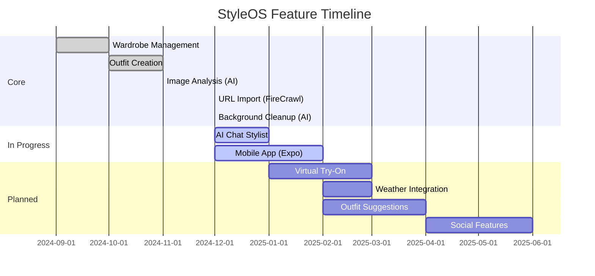

### Planned Features

| Feature | Status | Dependencies | Business Value |
|---------|--------|--------------|----------------|
| **AI Chat Stylist** | In Progress | Vercel AI SDK, chat history table | High engagement, differentiator |
| **Mobile App** | In Progress | Expo, shared packages | User retention, accessibility |
| **Virtual Try-On** | Schema Ready | Nanobanana API, body_photos table | WOW factor, conversion |
| **Weather Outfits** | Schema Ready | OpenWeatherMap, weather_cache | Daily utility |
| **Gap Analysis** | Schema Ready | wardrobe_analysis table | Upsell opportunities |
| **Social Sharing** | Planned | New tables needed | Viral growth |

### Technical Debt

| Item | Priority | Effort |
|------|----------|--------|
| Complete test coverage | Medium | High |
| CI/CD pipeline | High | Medium |
| Error boundary components | Medium | Low |
| Accessibility audit | Medium | Medium |
| Performance monitoring | High | Low |

---

## Appendix

### Environment Variables

| Variable | Required | Description |
|----------|----------|-------------|
| `VITE_SUPABASE_URL` | Yes | Supabase project URL |
| `VITE_SUPABASE_ANON_KEY` | Yes | Supabase publishable key |
| `VITE_API_URL` | Yes | Backend API URL |
| `SUPABASE_URL` | Yes | Supabase URL (backend) |
| `SUPABASE_SERVICE_KEY` | Yes | Supabase service role key |
| `GEMINI_API_KEY` | Yes | Google Generative AI key |
| `FIRECRAWL_API_KEY` | Yes | FireCrawl API key |
| `CORS_ORIGINS` | Yes | Allowed CORS origins |
| `ENVIRONMENT` | No | development/production |

### Quick Start

```bash
# Clone and install
git clone https://github.com/your-org/styleos.git
cd styleos
npm install

# Start Supabase Local (requires Docker)
npm run db:start
npm run db:reset

# Copy environment files
cp .env.example .env.local
cp backend/.env.example backend/.env.local
# Fill in API keys

# Start development
npm run dev:all
```

### Contact

- **Live Site:** [https://styleos.dev](https://styleos.dev)
- **Repository:** [GitHub](https://github.com/your-org/styleos)

---

*Generated: December 2024*
